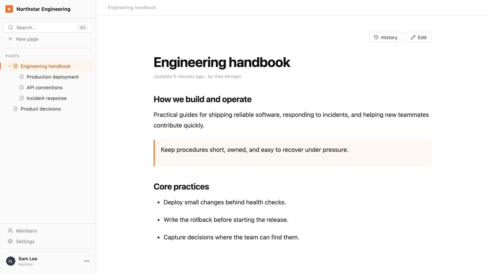
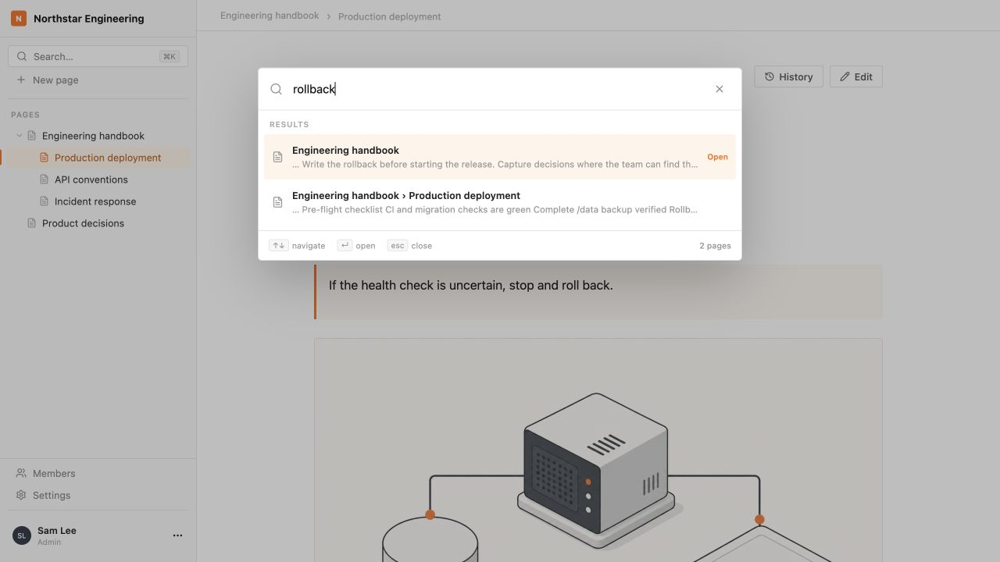
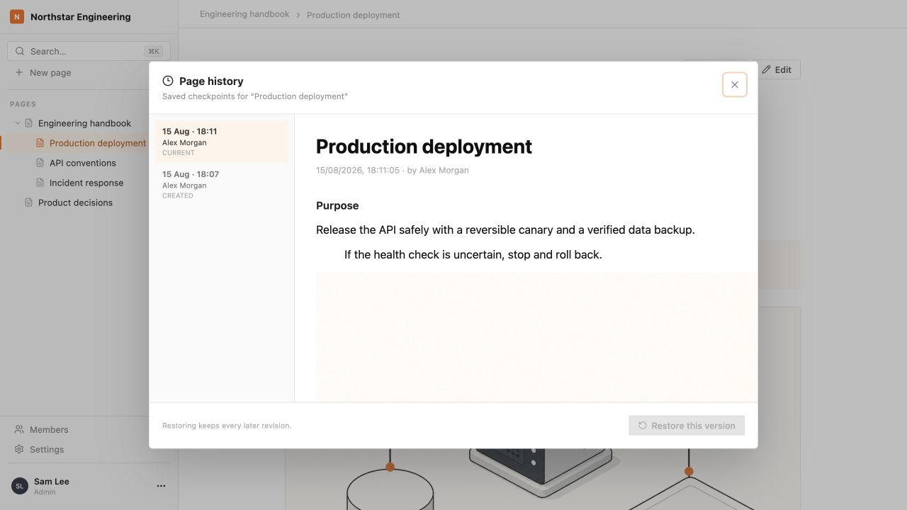

<div align="center">
  
  <h1>Pagecairn</h1>
  <p><strong>A lightweight, self-hosted wiki for small software teams.</strong></p>
  <p>
    <a href="https://bybogdan.github.io/pagecairn/">Product page</a>
    ·
    <a href="docs/self-hosting.md">Self-hosting guide</a>
    ·
    <a href="CONTRIBUTING.md">Contributing</a>
  </p>
</div>



Pagecairn gives a small team one focused place to write, organize, and find
documentation without operating a workspace platform. It runs as one
application container with SQLite and local uploads stored together in one
persistent volume.

## What it does

- Create, edit, nest, move, and delete pages.
- Write rich text, headings, lists, checklists, links, code, quotes, tables,
  images, and file attachments.
- Search page titles and content from anywhere in the workspace.
- Review and restore saved page revisions.
- Invite teammates with simple Admin and Member roles.
- Keep the database and uploads together in storage you control.

## Quick start

Requirements: Git and Docker with the Compose plugin.

```bash
git clone https://github.com/bybogdan/pagecairn.git
cd pagecairn
docker compose up -d --build
```

Open [http://localhost:3000](http://localhost:3000), create the workspace and
first admin account, then start writing.

Port 3000 is plain HTTP. Before exposing a production installation, configure
TLS through a reverse proxy and enable secure session cookies. Follow the
[production self-hosting guide](docs/self-hosting.md) for prerequisites,
configuration, backup, restore, tagged updates, recovery, and troubleshooting.

## One recoverable installation

The named Docker volume is mounted at `/data` and contains the complete backup
unit:

```text
/data
├── database.sqlite
└── uploads/
```

Recreating the application container preserves this volume. Back up the entire
directory while the application is stopped; never copy only the SQLite file or
run `docker compose down -v` unless you intend to delete the installation data.

## Product views

| Search titles and content | Review saved revisions |
| --- | --- |
|  |  |

The initial release deliberately stays small: one workspace per installation,
local accounts, manually shared invitation links, SQLite, local file storage,
and no real-time multiplayer editing. See [AGENTS.md](AGENTS.md) for the product
principles and explicit non-goals.

## Development

Use Node.js 22 or newer:

```bash
npm install
npm run dev
```

Before submitting a change:

```bash
npm test
npm run build
```

Read [CONTRIBUTING.md](CONTRIBUTING.md) before opening a pull request. Report
suspected vulnerabilities privately according to [SECURITY.md](SECURITY.md).

## AI-assisted development

Pagecairn was built with OpenAI Codex using role-based agents for exploration,
implementation, independent QA, and release management. The
[product instructions](AGENTS.md), [agent definitions](.codex/agents/), and
[reusable workflows](.agents/skills/) are included for anyone interested in
studying or adapting the process.

## License

Pagecairn is available under the [MIT License](LICENSE).
